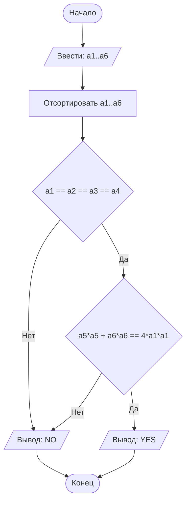

# Lab1
## Отчет по лабораторной работе № 1

#### № группы: `ПМ-2601`

#### Выполнил: `Быков Дмитрий Владимирович`

#### Вариант: `5`

### Cодержание:

- [Постановка задачи](#1-постановка-задачи)
- [Входные и выходные данные](#2-входные-и-выходные-данные)
- [Выбор структуры данных](#3-выбор-структуры-данных)
- [Алгоритм](#4-алгоритм)
- [Программа](#5-программа)
- [Анализ правильности решения](#6-анализ-правильности-решения)

### 1. Постановка задачи

>На вход программы подаются шесть натуральных чисел — все возможные
>расстояния между четырьмя точками на плоскости. Определить, являются
>ли эти 4 точки вершинами ромба ("YES"/"NO").

Данную задачу можно разделить на 2 подзадачи: найти среди шести расстояний четыре равных, 
выполняющих функцию сторон ромба, и два расстояния, больших первых четырёх, являющихся диагоналями ромба.

Получаем схему выполнения задачи:

  >  Отсортировать расстояния по длине

  > Проверить есть ли среди меньших 4 равных

  > Проверить являются ли оставшиеся два расстояния диагоналями

### 2. Входные и выходные данные

#### Данные на вход

На вход программа должна получать 6 натуральных чисел. О максимальном значении ничего не сказано.

#### Данные на выход

В условии задачи требуется на выход выдавать буквенный ответ: ("YES"/"NO").

### 3. Выбор структуры данных

Программа получает 6 натуральных чисел, максимальное значение которых не известно. Будем считать максимальным значением ограничение типа int.
Поэтому для их хранения можно выделить 6 переменных (`a1`, `a2`, `a3`,`a4`,`a5`, `a6`) типа `int`.

Для вывода результата необязательно его хранить в отдельной переменной.

### 4. Алгоритм

#### Алгоритм выполнения программы:

1. **Ввод данных:**  
   Программа считывает шесть натуральных чисел, обозначенные как `a1`, `a2`, `a3`,`a4`,`a5`, `a6`.

2. **Сравнение чисел:**  
   Программа сравнивает значения `a1`, `a2`, `a3`,`a4`,`a5`, `a6` и сортирует их по размерам с помощью новых переменных `b1`, `b2`, `b3`,`b4`,`b5`, `b6`

3. **Проверка сторон:**
   Программа проверяет, что первые четыре переменные равны между собой. Если нет — точки не являются вершинами ромба.

4. **Проверка диагоналей**  
   Программа проверяет, что для двух последних переменных выполняется тождество параллелограмма: a5² + a6^2 = 4·a1^2. Если нет — точки не являются вершинами ромба.
#### Блок-схема



### 5. Программа

```java
import java.io.PrintStream;
import java.util.Scanner;

public class Main {
    // Объявляем объект класса Scanner для ввода данных
    public static Scanner in = new Scanner(System.in);
    // Объявляем объект класса PrintStream для вывода данных
    public static PrintStream out = System.out;

    public static void main(String[] args) {
        // Считывание двух вещественных чисел x и y из консоли
        double x = in.nextDouble();
        double y = in.nextDouble();

        // Определение максимального числа
        if (x >= y) {
            // Если x положительное, выводим x, иначе выводим -x,
            // чтобы на выходе было его абсолютное значение
            if (x >= 0) {
                out.println(x);
            } else {
                out.println(-x);
            }
        } else {
            // Если x положительное, выводим y, иначе выводим -y,
            // чтобы на выходе было его абсолютное значение
            if (y >= 0) {
                out.println(y);
            } else {
                out.println(-y);
            }
        }
    }
}
```

### 6. Анализ правильности решения

Программа работает корректно на всем множестве решений с учетом ограничений.

1. Тест на `X > Y > 0`:

    - **Input**:
        ```
        5 1.3
        ```

    - **Output**:
        ```
        5
        ```

2. Тест на `X < Y < 0`:

    - **Input**:
        ```
        -4 -2.2
        ```

    - **Output**:
        ```
        2.2
        ```

3. Тест на `X < 0 < Y`:

    - **Input**:
        ```
        -4 5
        ```

    - **Output**:
        ```
        5
        ```

4. Тест на `X = 0` или `Y = 0`:

    - **Input**:
        ```
        0 -3
        ```

    - **Output**:
        ```
        3
        ```

5. Тест на ограничение задачи:

    - **Input**:
        ```
        -1000000000 1000000000
        ```

    - **Output**:
        ```
        1000000000
        ```
